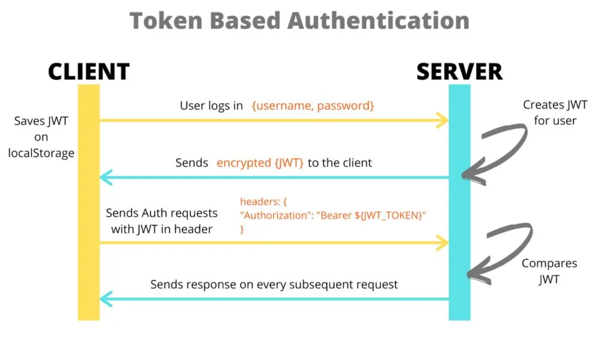

# Задание по JWT Аутентификации в FastAPI

## Обзор
В этом задании вы реализуете JWT (JSON Web Token) аутентификацию в приложении FastAPI. За вас уже написано (и нужно разобраться в том что написано!):
1. Эндпоинт для генерации JWT токенов
2. Middleware для проверки JWT токенов
3. Защищённый эндпоинт, требующий действительный jwt token

Почитать про jwt token можно тут: https://jwt.io/introduction
Или вот хорошая статья на медиуме: https://medium.com/@extio/understanding-json-web-tokens-jwt-a-secure-approach-to-web-authentication-f551e8d66deb

### 1: Генерация JWT токена
Обычно для генерации jwt токена используют функционал облака, так называемый IAM. Но мы сегодня побудем облаком сами. 
Создайте эндпоинт `/auth/token`:
- Принимает POST-запросы с именем пользователя и паролем в теле запроса
- Проверяет учётные данные (для этого задания принимайте любое имя пользователя с паролем "secret123")
- Возвращает JWT токен, содержащий имя пользователя, время действия и полезную нагрузку на основе SECRET_KEY из переменных окружения
- Обычно время действия токена 30 минут, но в рамках этого задания мы будем создавать токены которые годны всего 15 секунд (для этого нужно указать правильное значение в поле exp)
- Проставьте claims iat, exp, sub - в соответвии с известной информацией: https://auth0.com/docs/secure/tokens/json-web-tokens/json-web-token-claims#registered-claims

Пример: https://yandex.ru/dev/id/doc/ru/tokens/jwt

### 2: Middleware для проверки JWT
Реализуйте middleware (middleware.py или внутри main_service.py, как хотите), которое обрабатывает все запросы к основному сервису (main_service.py):
- Извлекает JWT токен из заголовка Authorization (Bearer token)
- Проверяет подпись токена и срок его действия (Здесь вам снова понадобится SECRET_KEY из переменых окружения)
- Добавляет декодированное имя пользователя в состояние запроса (нам оно нужно будет дальше, чтобы сказать нужный текст в пункте 3)
- Возвращает 401 Unauthorized для недействительных/отсутствующих токенов, и возвращает соотвествующие ошибки: "Missing or invalid authorization header", если он не найден и "Invalid or expired token", если не получилось его расшифровать.
- Разрешает определённым эндпоинтам обходить аутентификацию (например, /docs)

## Ваша задача:

### Допишите Rate Limiting Middleware
Реализуйте дополнительное middleware для ограничения количества запросов (rate limiting):
- Ограничьте количество запросов с одного IP-адреса до 5 запросов в 2 sec
- Используйте in-memory хранилище (например, словарь) для отслеживания запросов
- При превышении лимита возвращайте статус 429 Too Many Requests с сообщением "Rate limit exceeded. Try again in {seconds} seconds"
- Добавьте следующие заголовки в ответ:
  - X-RateLimit-Limit: максимальное количество запросов
  - X-RateLimit-Remaining: оставшееся количество запросов
  - X-RateLimit-Reset: время в секундах до сброса счётчика
- Реализуйте "sliding window" подход для более точного отслеживания времени
- Реализуйте функцию rate_limiter_reset чтобы упростить тестирование :) Логика ее работы понятна из тестов: нужно обнулить текущие счетчики.
- Комбинируйте с уже существующим JWT middleware для `/api/protected`

## Важное!
- {SECRET_KEY} должен лежать в переменных окружения, и нужно воспользоваться pydantic_settings, чтобы его взять. Для локального тестирования я рекомендую запускать с помощью: `SECRET_KEY=ilovepython python main_service.py`
- SECRET_KEY должен быть ключом в config.settings 
