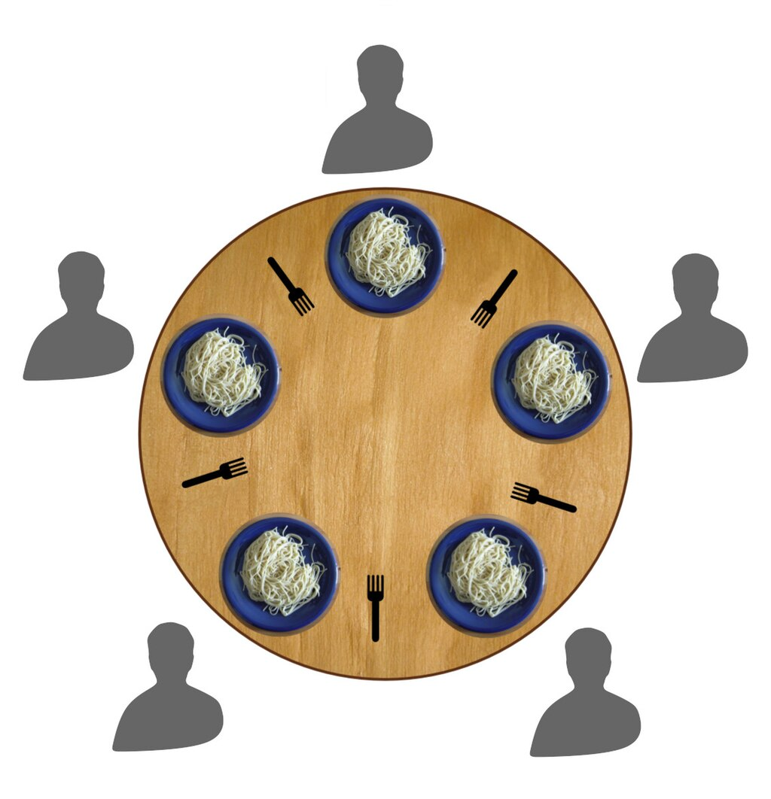

# Проблема обедающих философов

## Описание задачи


Проблема обедающих философов — это классическая задача синхронизации в информатике. Она была первоначально сформулирована Эдсгером Дейкстрой, чтобы иллюстрировать сложности распределения ресурсов и предотвращения взаимоблокировок в конкурентных системах.

Представьте себе n философов, сидящих вокруг круглого стола. Перед каждым философом стоит тарелка спагетти. Между каждой парой соседних философов находится по одной вилке. Каждому философу нужны две вилки для еды, и он может использовать только вилки, расположенные непосредственно слева и справа от него.


Философы чередуют три состояния: размышление, голод (попытка взять вилки) и еда. Задача состоит в разработке решения, при котором:
* Каждый философ может чередовать состояния еды и размышления.
* Два соседних философа не могут одновременно есть.
* Отсутствует взаимоблокировка (ситуация, при которой прогресс невозможен).
* Отсутствует голодание (каждый философ в конечном итоге должен иметь возможность поесть).

Более понятная схема:



## Требования к задаче

Реализуйте решение задачи обедающих философов на Python с следующими спецификациями:

* Создайте класс Philosopher, представляющий поток философа.
* Создайте класс Fork, представляющий вилку (общий ресурс).
* Реализуйте класс DiningPhilosophers, который управляет всей системой.
* Ваше решение должно работать для любого количества философов (n).
* Используйте модули threading и примитивы синхронизации из модуля threading в Python.
* Реализуйте механизм предотвращения или обнаружения взаимоблокировки.
* Включите логирование для отображения изменений состояний философов и вилок.
* Реализуйте метод для запуска симуляции на определенное время или до завершения определенного количества циклов еды.

## Структура классов

Вот предложенная структура для вашей реализации:

```python
import threading
import time
import logging

class Fork:
    def __init__(self, index: int):
        self.lock: threading.Lock = threading.Lock()
        self.index: int = index
        # Добавьте любые другие необходимые атрибуты

    def is_locked(self) -> bool:
        """Check if the fork is locked"""
        ...

class PhilosopherState(StrEnum):
    THINKING = "thinking"
    HUNGRY = "hungry"
    EATING = "eating"

class Philosopher(threading.Thread):
    def __init__(
        self,
        index: int,
        left_fork: Fork,
        right_fork: Fork,
        get_think_time: Callable[[], float],
        get_eat_time: Callable[[], float]
    ):
        super().__init__()
        self.index : int = index
        self.left_fork : Fork = left_fork
        self.right_fork : Fork = right_fork
        # Добавьте любые другие необходимые атрибуты

    def run(self):
        # Реализуйте основную логику жизненного цикла философа

    def is_eating(self) -> bool:
        ...
    
    def is_hungry(self) -> bool:
        ...
    
    def is_thinking(self) -> bool:
        ...
    
    def count_meals(self) -> int:
        ...
    

class Dinner:
    def __init__(
        self,
        num_philosophers,
        get_think_time: list[Callable[[], float]],
        get_eat_time: list[Callable[[], float]]
    ):
        self.num_philosophers = num_philosophers
        self.philosophers = []
        self.forks = []
        # Инициализируйте вилки и философов
        # get_think_time и get_eat_time - список функций, которые возвращают время для размышления и еды для каждого философа

    def run_simulation(self, duration):
        # Запустите симуляцию и выполните ее в течение указанного времени

    def stop_simulation(self):
        # Реализуйте метод для корректной остановки симуляции
```

Думали это все? А нет, еще нет...
Нужно добавить тесты, которые проверят, что:
* Симуляция корректно обрабатывает взаимоблокировки.
* Симуляция корректно обрабатывает голодание.
* Симуляция корректно обрабатывает размышления.
* Симуляция корректно обрабатывает еду.

В test_public.py нужно дополнить следующий код:

```python

class PhilosopherSimulationChecker:
    def __init__(self, dinner: Dinner):
        self.dinner : Dinner = dinner
        self.philosophers : List[Philosopher] = dinner.philosophers
        self.forks : List[Fork] = dinner.forks

    def check_deadlock(self) -> bool:
        """
        Check if the system is in a deadlock state.
        """
    
    def check_starvation(self, timeout: int = 10) -> bool:
        """
        Check if any philosopher is starving (hasn't eaten for a long time).
        """

    def check_mutual_exclusion(self) -> bool:
        """
        Check if no two adjacent philosophers are eating simultaneously.
        """
    
    def comprehensive_check(self, duration: float) -> bool:
        """
        Run a comprehensive check for a specified duration.
        """
```

Эти тесты нужно дописать в test_public.py и убедиться что ваше решение проходит их. Это даст вам 10 баллов. Дальше в приватных тестах будут другие тесты, построенные на тех же принципах, и будет так же проверяться что неправильное решение не пройдет ваши тесты.