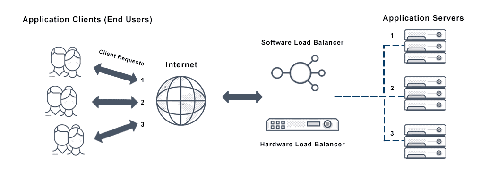

# Проблема маршрутизации запросов

Представьте, что вы разрабатываете систему маршрутизации запросов для интернет-магазина (на самом деле это может быть что угодно). У вас есть N серверов, которые могут обрабатывать запросы. Каждый сервер имеет разные параметры производительности.

Вам нужно реализовать систему балансировки нагрузки, которая будет распределять запросы между серверами таким образом, чтобы:

* Максимально равномерно распределять нагрузку между серверами при параллельных запросах.
* Минимизировать количество переключений между серверами (то есть, если сервер обрабатывает запрос, он должен продолжать обрабатывать запрос, пока не закончит или не произойдёт сбой). Если запросы приходят с одного клиента, они всегда должны идти на один и тот же сервер, это будет позволять приложению кешировать данные на стороне сервера.
* Обрабатывать сбои серверов, то есть, если сервер недоступен, он должен быть исключен из распределения нагрузки, а когда он станет доступен, он должен быть добавлен обратно.
* Максимальная нагрузка на сервер или router не должна превышать max_load, в противном случае сервис должен ждать освобождения ресурсов, не выкидывая ошибок (воспользуйтесь semaphore).

Подсказка: для решения этой задачи можно использовать алгоритм [Round Robin](https://en.wikipedia.org/wiki/Round-robin_scheduling), а именно его продвинутый вариант [Weighted Round Robin](https://en.wikipedia.org/wiki/Weighted_round_robin).

## Описание задачи

Здесь представлены классы, которые вам нужно будет реализовать:

```python
class Request:
    def __init__(self, client_id: str, request_id: str, processing_time: float):
        self.client_id = client_id
        self.request_id = request_id
        self.processing_time = processing_time
```

```python
class Server:
    """
    Represents a server that can process requests.
    """
    def __init__(self, server_id: str, performance_score: int):
        self.server_id = server_id
        self.performance_score = performance_score

    def process_request(self, request: Request) -> None:
        """
        Processes a request. Save the request client_id and request_id.
        """
        pass

    def is_alive(self) -> bool:
        """
        Checks if the server is alive.
        """
        pass
    
    def crash(self) -> None:
        """
        Crashes the server.
        """
        pass

    def recover(self) -> None:
        """
        Recovers the server.
        """
        pass


    def is_processed(self, request_id: str) -> bool:
        """
        Checks if the request is processed. Emulates caching.
        """
        pass
```

```python
class Router:
    """
    Represents a router that can route requests to servers.
    """
    def __init__(self, servers: List[Server], max_load: int):
        pass

    def route(self, request: Request) -> None:
        pass

    def add_server(self, server: Server) -> None:
        pass

    def remove_server(self, server: Server) -> None:
        pass
```

## Немного полезной информации

* Round Robin подразумевает хранение списока серверов и выбирает из него по очереди, при достижении конца списка, возвращайтеся в начало (% len(servers))
* Чтобы реализовать Weighted Round Robin используйте список кортежей (server, weight), где weight - это вес сервера. Выбирая сервер, выбирайте его с вероятностью пропорциональной весу. 
* Помните, что роутер должен обрабатывать не более чем max_load запросов. 
* Для реализации сбоев и восстановлений можно использовать методы `crash()` и `recover()` класса `Server`. При реализации сбоев и восстановлений помните про перерассчет весов для роутинга
* Добавление и удаление должно быть реализовано так, чтобы минимальное число клиентов "сменило" сервер при следующем запросе, однако при этом сервера должны быть нагружны равномерно
* Для синхронизации доступа к разделяемым ресурсам используйте средства синхронизации из библиотеки `threading`. Предполагается что все блокировки будут происходить как операция ввода-вывода, поэтому предполагается что маршрутизатор будет использоваться в многопоточном приложении.